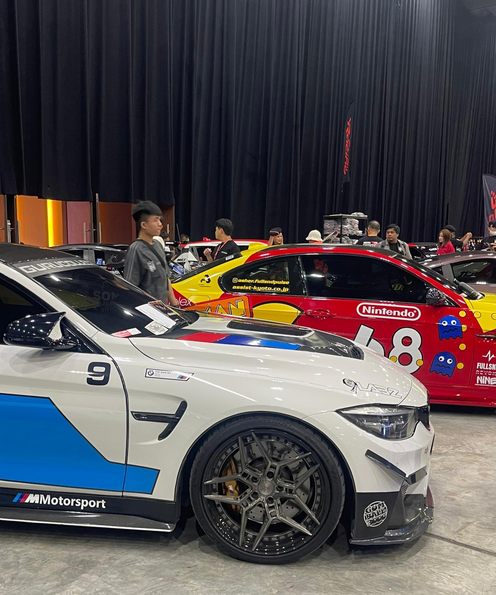
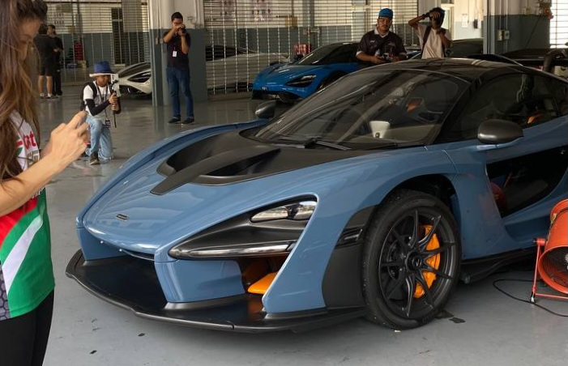

<head>
  <meta charset="UTF-8" />
  <meta name="viewport" content="width=device-width, initial-scale=1.0" />
  <title>vzmama | Automotive & visuals </title>  </head>
<body>  <nav>
    <h1>vzmama</h1>
    <ul>
      <li><a href="https://vzmama0-boop.github.io/_/">Gallery</a></li>
      <li><a href="https://vzmama0-boop.github.io/about/">About</a></li>
    </ul>
  </nav>  <section class="hero">
    <h2>Automotive & visuals</h2>
    
Capturing moments at car meets & events

  </section>  <section class="preview">
    <h3>FEATURED</h3>
      
Car Meet

      
Details

      
Event

    

  

    
    Car Meet
  

  

    
    Details
  

  

    
    Event
  

  <footer>
    © 2026 vzmama — All shots by me unless stated
  </footer>
